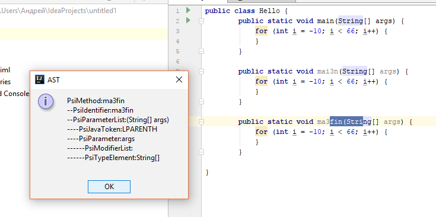
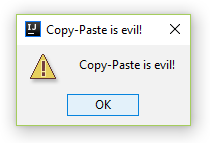

# Anti-CP-Plugin
This plugin provides visual representation of Abstract Syntax Tree (AST) 

# Usage

To start plugin, simply run this command from project directory:

```./gradlew runIde```

To display AST of code block, follow these steps:

1) Select a code block you want to display
2) Press  button in toolbar

Result: <br/>



An addition, any paste action will cause warning about harm of copy-paste: <br/>



## Implementation details:

### Copy-Paste Message:

Alert is presented by IntelliJ API

Paste event is detected by extending ```CopyPastePreProcessor``` extension point

### AST representation of code block:

AST is represented upsing PSI.
IntelliJ SDK provides selected code block bounds and AST nodes associated with them. Then bounding elements LCA will be found.

After that AST will be represented using traversal: 
1) Output root element on depth ```k```
2) Find root childs (```u```, ```v```) corresponding to bounding nodes
3) Represent all subtrees between ```u``` and ```v``` recursively on depth ```k+1```: for subtree ```u``` bounding elements will be ```u``` and rightmost node, for subtree ```v``` - leftmost node and ```v```, for subtrees between u and v - their leftmost and rightmost nodes
